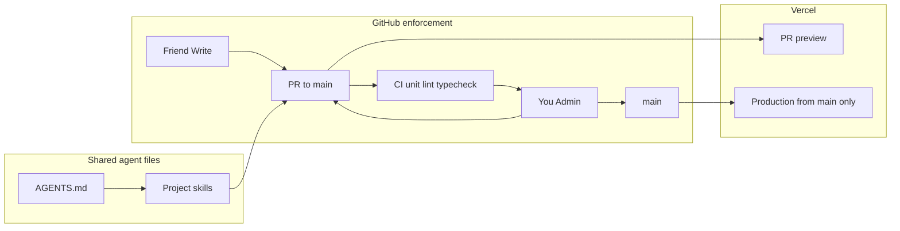
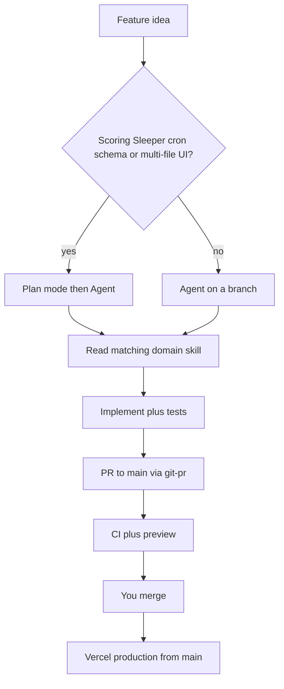

# Collaborate on GitHub with Cursor and Claude Code

This repo already has the right agent baseline: short `[AGENTS.md](AGENTS.md)`, `[CLAUDE.md](CLAUDE.md)` importing it with `@AGENTS.md`, and domain skills in `[.cursor/skills/](.cursor/skills/)`. GitHub/Vercel enforcement is **already done** (Write collaborator, `main` ruleset, squash-only PRs, secret scanning, production from `main` only). What is still missing is **shared workflow skills** (your personal commit/PR rules live only in Cursor user rules, so your friend’s Claude Code/Cursor will not see them) plus CI/CODEOWNERS/PR template in the repo.




## Principles (token-stingy)

- **Enforce in GitHub, remind in agents.** Branch rulesets stop `main` pushes; skills do not.
- **One always-on file.** Put hard collaboration rules in `[AGENTS.md](AGENTS.md)` (~15 extra lines). Do not add always-apply `.cursor/rules` that repeat it.
- **Skills are playbooks, not essays.** Four on-demand skills with tight `description` triggers. Keep existing domain skills (sleeper, roulette-scoring, standings-image, weekly-final) where they are.
- **No duplicate skill bodies.** Canonical skills stay in `.cursor/skills/`. Add relative symlinks under `.claude/skills/` so Claude Code auto-discovers the same files. Cursor already loads both.
- **CI is cheap and required.** Lint + typecheck + `npm run test:unit` only. Do **not** run live Sleeper tests or `vercel --prod` in Actions. Vercel’s Git integration already deploys; a second deploy workflow would double cost and risk.

## Part 1 — Manual GitHub and Vercel steps (done)

Completed in GitHub/Vercel: Write collaborator (you stay Admin), `main` ruleset, squash-only PRs / auto-delete branches, secret scanning + push protection, Vercel production from `main` only (friend not on the Vercel team).

Still yours after the repo files land:

- **Onboarding message** (send after `CONTRIBUTING.md` and skills are on `main`). Draft at the end of this plan.
- **Require the `ci` status check** on the `main` ruleset only if it is not already required. If you already required a check named `ci` before the workflow exists, the first bootstrap PR may need your admin bypass; then the check will apply to his PRs.

## Part 2 — Repo files to add

### GitHub glue

- `[.github/CODEOWNERS](.github/CODEOWNERS)`: `* @YOUR_GITHUB_USERNAME` so every PR requests you.
- `[.github/PULL_REQUEST_TEMPLATE.md](.github/PULL_REQUEST_TEMPLATE.md)`: Summary + Test plan (same shape as your existing PR rule).
- `[.github/workflows/ci.yml](.github/workflows/ci.yml)`: `npm ci`, `npm run lint`, `npx tsc --noEmit`, `npm run test:unit`. No live Sleeper, no Vercel token.
- `[CONTRIBUTING.md](CONTRIBUTING.md)` for humans: same junior-friendly, command-by-command flow as the onboarding message (clone → run locally → branch → PR). Not an agent manifesto. Include a note that Cursor/Claude Code should follow `AGENTS.md` and `.cursor/skills/`.

### Always-on agent addendum in `[AGENTS.md](AGENTS.md)`

Add a compact **Collaboration** section (not a second manifesto):

- Never commit, push, or merge to `main`. Feature branches only; squash via GitHub.
- Before a PR: `npm run lint`, `npx tsc --noEmit`, `npm run test:unit`. Live `npm run test:sleeper` only when changing Sleeper/scoring against real leagues.
- Production deploys only by merging to `main`. Never `vercel --prod`, never promote/rollback, never set `SLEEPER_CHAT_POST`.
- When committing, opening, or reviewing a PR, or touching deploy/test policy, read the matching skill under `.cursor/skills/`.
- New work starts on a feature branch off latest `main`. One independently reviewable outcome per PR. If a change invents a durable convention, update the matching skill in that same PR.
- Align the existing `npm test` sentence with `[package.json](package.json)`: unit = `lib/*.test.ts`; live = `lib/*.live.test.ts` (`test:sleeper`). Today AGENTS.md implies live checks are inside `npm test`; they are not.

Leave scoring/league IDs as they are. Do not copy them into the new skills.

### Four project skills (canonical in `.cursor/skills/`, symlinked in `.claude/skills/`)

Keep each SKILL.md short. Descriptions must include **what** and **when** so they load only for those tasks.

1. `**git-pr**` — branches, commits, PRs. Use when creating a branch, committing, pushing, or opening a PR.
  - Branch from latest `main`: `feat/`, `fix/`, `chore/` + short slug.
  - No `git add -A`; no commits of `.env*`, secrets, or `node_modules`.
  - Commit message: 1–2 sentences on **why**, HEREDOC, no `--amend` unless the user asked and the commit is unpushed.
  - Open PRs with `gh pr create` against `main`; body = Summary + Test plan; never target `main` with a direct push.
  - No force-push to `main`; force-push own feature branch only if the user asked and the branch is not shared.
  - Encode your existing commit/PR user rules here so Claude Code sees them.
2. `**code-review**` — reviewing a PR (yours or his). Use when asked to review a PR, diff, or branch.
  - `gh pr checkout` / `gh pr diff`; compare to `main`.
  - Blocking: scoring/Sleeper invariant breaks, missing tests for those changes, secrets, chat-post enabled, production deploy from a branch, pushes to `main`.
  - Non-blocking: style nits the linter would catch.
  - Output: Critical / Suggestion / Nice-to-have. Do not merge unless the user is you and CI is green.
  - Optionally run Bugbot/security-review only when the user asks (those subagents are already in this environment).
3. `**testing**` — when and how to add tests. Use when adding features, fixing bugs, or writing tests.
  - Scoring → `[lib/roulette.test.ts](lib/roulette.test.ts)` and reconcile tests; do not skip the 2025 Shadynasty live net when changing scoring (run locally, not in CI).
  - Sleeper client → `[lib/sleeper.test.ts](lib/sleeper.test.ts)`; keep one HTTP helper.
  - UI/layout: browser-verify the real flow (your existing user rule).
  - CI bar: unit tests must pass; do not add network calls to `*.test.ts`.
4. `**deploy**` — production-safe Vercel. Use when deploying, changing `vercel.ts`/crons, env vars, or Prisma migrations.
  - Production = Vercel Git deploy of `main` after merge. Preview = PR URL. Never `vercel --prod` / `promote` / `rollback` unless you explicitly ask.
  - Never write Vercel env from an agent. Chat upload stays fail-closed (`[weekly-final](.cursor/skills/weekly-final/SKILL.md)`).
  - Prisma: PRs may add migrations; do not run `prisma migrate deploy` against production from a feature branch. Note the current gap: `[package.json](package.json)` `vercel-build` runs `prisma generate` but **not** `migrate deploy` — call that out in the skill so agents do not assume schema applies itself. (Fixing that pipeline is out of scope unless you want it in the same change.)

Do not create a fifth “code quality” or “new feature” skill. The feature loop lives in `AGENTS.md` (always on, few lines). Quality gates are CI + review checklist + existing domain skills.

## How this matches your workflow (you, not only your friend)

You already work the way this repo should: Plan mode for non-obvious features, domain skills for Sleeper/scoring/images/cron, tests before calling it done, UI checked in the browser, then a PR. The GitHub ruleset does not change that loop — it just makes **you** use a branch + PR too, instead of committing on `main`. You can still merge your own PRs after CI (admin bypass). Production still only moves when `main` updates.

Personal Cursor user rules (commits, PRs, browser verify) keep applying to you. Repo skills are the copy your friend and Claude Code will actually see. Treat the repo skills as source of truth for this project so the two copies do not drift.

**When you are thinking of a new feature, run this loop:**

1. **Decide if it needs a plan.** Scoring, Sleeper, cron, schema, or multi-file UI → stay in Plan until the approach is settled. A typo or one-file copy fix → Agent on a branch.
2. **Name the domain skills that apply before coding.** Example: weekly PNG + chat fail-closed → `standings-image` + `weekly-final`. Do not paste those rules into the chat; the agent should read the skill. If you are not sure, say “read the matching `.cursor/skills` first.”
3. **Branch off latest `main`**, then implement. One PR = one reviewable outcome (same split you already use for Jira-sized work). Stacked PRs only when the second change truly depends on the first.
4. **Tests travel with the change** (`testing` skill): scoring → `lib/roulette.test.ts`; Sleeper client → `lib/sleeper.test.ts`; live reconcile only when those invariants moved. UI → exercise the real flow, not a single screenshot.
5. **Ship with `git-pr`:** commit why, PR to `main` with Summary + Test plan, wait for CI. Preview URL is the check that Vercel still works. You merge; production deploys from `main` (`deploy` skill). Do not `vercel --prod` from the branch.
6. **Keep skills useful in the same PR.** If you invent a convention the next agent must follow (new helper, new test file pattern, new env var), update that skill now. If the work is one-off, do **not** add a skill — leftover skills rot and waste tokens.

**Efficiency rules (token-stingy, still fast):**

- Start the chat on the feature branch, with a concrete outcome (“add X, tests in Y, PR when green”).
- Invoke a skill by name only at that phase (`/git-pr`, `/testing`, `/code-review`) instead of loading all four every time.
- Do not grow `AGENTS.md` with feature specs. Durable domain facts go in domain skills; process stays in the four workflow skills.
- After merge: `git checkout main && git pull` before the next feature so you and your friend do not fork history.



## Suggested implementation order

1. Write skills + `AGENTS.md` addendum + `CONTRIBUTING.md` + GitHub templates/CODEOWNERS/CI on a feature branch; you merge it to `main` (bootstrap; use admin bypass if `ci` is already a required check).
2. If `ci` is not yet a required status check, add it after the first green run on `main`.
3. Send the onboarding message below.

His first PR should be something small (docs-only is fine) so you both verify: he cannot push `main`, you get a review request, CI runs, preview URL appears, only you can merge.

## Onboarding message (send after merge)

Replace the clone URL with the real GitHub repo URL. Same steps belong in `CONTRIBUTING.md`.

```
Hey — you're on the repo. Goal is: run it on your laptop, make edits, then open a pull request so I can review before anything hits the live site. Don't commit or push to main; GitHub will block that anyway.

You'll need Git and Node.js (LTS) installed. Then run these in order.

1) Get the code

git clone https://github.com/OWNER/roulettestandings.git
cd roulettestandings

2) Install and start it locally

cp .env.example .env.local

Open .env.local in a text editor. Set ADMIN_PASSWORD to any dummy password you invent (for /login on your laptop). Leave DATABASE_URL, CRON_SECRET, SLEEPER_TOKEN, and SLEEPER_CHAT_POST alone — don't paste production secrets.

npm install
npm run dev

Open http://localhost:3000 in a browser. Stop the server with Ctrl+C when you're done.

3) Before you edit, start a branch from latest main (never edit on main)

git checkout main
git pull
git checkout -b feat/short-description

Example: feat/fix-typo or fix/login-button. Do your work on that branch.

4) When you're ready for me to look

npm run test:unit

git add path/to/the/files/you/changed
git status
git commit -m "Why you made this change."
git push -u origin HEAD

Then open the repo on GitHub. You should see a "Compare & pull request" button. Target branch must be main. Add a short summary and how you tested it (even "ran npm run dev and clicked X"). Don't merge it — ping me and I'll review.

If Cursor or Claude Code is helping: open this folder as the project. Follow AGENTS.md and the skills in .cursor/skills/. CONTRIBUTING.md in the repo is this same walkthrough.

If anything errors, send me the command you ran and the output. Don't force-push, don't push to main, and don't commit .env.local.
```