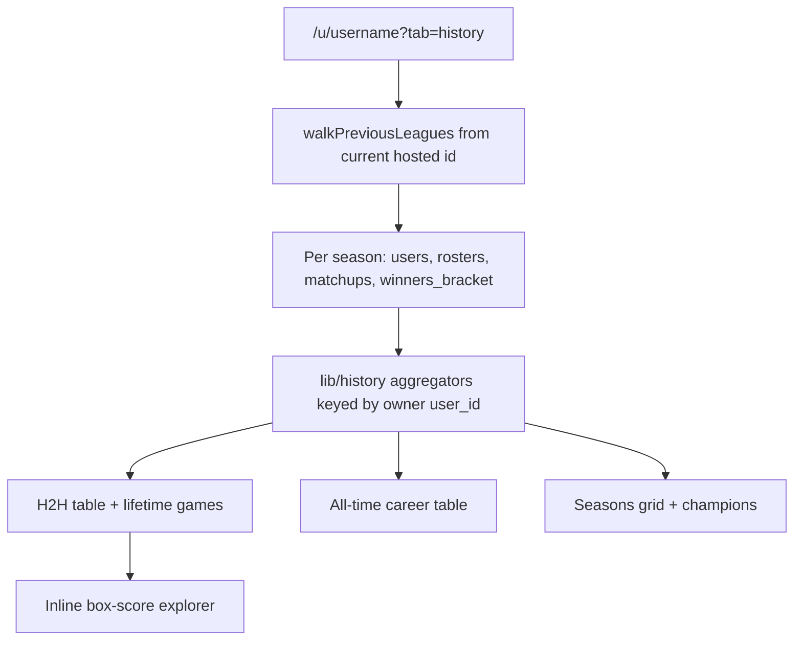

# History tab (H2H, All-time, Seasons)

## TDD workflow (do this first)

Do not implement aggregators or UI until the unit tests exist and have been run once as failing.

1. Write expected **input/output pairs** in [`lib/history.test.ts`](lib/history.test.ts) against the public functions in [`lib/history.ts`](lib/history.ts). Fixtures are small in-memory season snapshots (owners, weekly paired games, brackets). No network.
2. Run `npm run test:unit` (or `npx tsx --test lib/history.test.ts`) and **confirm fail** (missing module or assertion failures).
3. Implement the pure functions until those tests **pass**.
4. Only then add Sleeper loaders and UI. Loader/UI must call the tested functions, not re-derive records in components.
5. If a fixture is wrong, fix the fixture and re-run; do not weaken assertions to match accidental implementation.

Update the testing skill in the same PR: history math lives in `lib/history.test.ts`.

Concrete pairs to encode (minimum):

- **H2H season cell:** two owners, season 2024 RS 2-0 plus playoff 0-1 against the same opponent → cell `2-1`, win% green. Season with no games → `—`, uncolored. Season with only ties → `0-0-2` (T shown), uncolored.
- **H2H all-time row extras:** same pair across 2023 (`1-0`, PF 120 / PA 100) and 2024 (`2-1`, PF 330 / PA 310) → all-time W–L `3-1`, PF `450`, PA `410`.
- **All-time career + Include Playoffs:** one owner, RS 10-4, PF 1400, PA 1300, PTS 24; plus two playoff games 1-1, PF +80, PA +90. Unchecked: W–L `10-4`, PTS `24`, PF `1400`, PA `1300`. Checked: W–L `11-5`, PTS still `24`, PF `1480`, PA `1390`.
- **Column contract:** all-time row object field order used by the table is username, W–L, roulette PTS, PF, PA, then playoff counts.
- **Bracket roles:** 6-team fixture — seeds 1–2 bye, four round-1 teams, four semis, two finals, one champion. 4-team fixture — zero byes, four semis, two finals, one champion.
- **Seasons grid:** ranks by PTS then PF; playoff-berth flag true for top `playoff_teams` including last-seed PTS+PF ties. Champions list newest year first. Runner-ups grouped by owner, frequency desc.

Box-score scoring is also TDD: `scoreFromStats(stats, scoring_settings)` input/output pairs (missing stats → omit projection; empty product → omit).

## Placement

Add **History** as a fourth query tab on [`app/u/[username]/page.tsx`](app/u/[username]/page.tsx) via [`components/standings-tabs.tsx`](components/standings-tabs.tsx) (`Standings | Weekly | Bracket | History`). League toggle still picks the franchise; History always walks the **current** hosted league (`primary.sleeperLeagueId`), not the year dropdown, so later seasons are not dropped. Hide [`YearSelect`](components/year-select.tsx) on this tab.

Subtabs (query `history=`): **H2H** (default) | **All-time** | **Seasons**.

## Data and identity

Reuse [`walkPreviousLeagues`](lib/sleeper.ts) (raise `maxSeasons` from 8 to 20). Identify managers by Sleeper **`owner_id`**, display the **latest** `display_name` / `username` in the chain. Roster IDs are not stable across years.

For each season in the chain, fetch users, rosters, `getWinnersBracket`, and weekly `getMatchups` for regular season weeks `1 .. playoff_week_start - 1` (same completed-week rule as standings) plus playoff weeks `playoff_week_start .. playoff_week_start + 3` (skip empty weeks). Pair sides with existing `pairMatchups` / `liveMatchupPoints`. A game is playoff iff `week >= playoff_week_start`.

Do **not** add Prisma models. `sleeperGet` stays `cache: "no-store"` for live standings. Wrap the history snapshot in `unstable_cache` (~5 min) keyed by current league id so a 6–7 year chain does not fire ~100 Sleeper calls on every click.

Put fetch helpers in [`lib/sleeper.ts`](lib/sleeper.ts) (`getNflPlayers`, `getWeekProjections`) and a small `scoreFromStats` helper next to history/boxscore (not a second HTTP client). Aggregation in [`lib/history.ts`](lib/history.ts) (pure) + [`lib/history-load.ts`](lib/history-load.ts). Update the sleeper skill in the same PR.

## H2H

Client UI: manager `<select>` of everyone who ever appeared in the chain; default to the viewing username when they are in the league.

Opponent table columns, left to right:

- Opponent username
- **All-time W–L** — sum of combined regular+playoff wins/losses vs that opponent across every season (`W-L-T` only when ties exist)
- **All-time PF** — sum of the selected manager’s points in those games
- **All-time PA** — sum of the opponent’s points in those games
- One column per **season** (newest first)

Season cell is the **combined** regular+playoff W–L for that year. Show `W-L-T` only when ties exist. `—` if they did not play that year.

Color **season cells** by win% = `W / (W + L)` (ties ignored): **green if > .500**, **red if < .500**, uncolored if `.500`, no decided games, or `—`. Apply the same coloring to the all-time W–L cell.

Clicking an opponent row opens **lifetime games** below (regular + playoff): Season, Week, final score, **Box Score**. Newest first; mark playoff weeks.

### Box score: inline explorer (not a dialog)

**Recommendation:** put box scores in a dedicated section under the lifetime games list, with **season**, **week**, and **team** selectors. That is more fun than a modal for this product. History is lean-back browsing; a dialog hides the game list and makes hopping years/weeks feel like work. Selectors turn the archive into a time machine, which matches how people actually revisit old matchups. The rest of this app already stacks a table then the matchup underneath (standings + weekly).

Do **not** add shadcn Dialog for this.

Layout on H2H, top to bottom:

1. Manager filter + opponent table
2. Lifetime games vs the clicked opponent (hidden until an opponent is selected)
3. **Box score explorer**

Explorer controls: season (league-chain years), week (regular + playoff weeks that have matchups), team (owners in that season). Changing season resets week/team to a valid pair. Render the same two-sided card as a live matchup would: starters, bench (`players` minus `starters`), actual points per player and team totals. Projected starter totals from `/projections/nfl/regular/{season}/{week}` × that season’s `scoring_settings` (`scoreFromStats`). If projections are missing or score to nothing, **omit** projected columns/values.

A **Box Score** link in the lifetime table sets those three selectors to that game and scrolls to the explorer (no extra fetch shape). Data load: `GET /api/boxscore?league=&week=&roster=` guarded with `isAllowedLeague`. Cache `/players/nfl` for 24h.

Default explorer selection when an opponent is clicked: that opponent’s most recent game vs the filtered manager.

## All-time

One row per owner. Client checkbox **Include Playoffs** (off by default). Starred columns recompute when checked.

Column order (left to right):

- Username
- **W–L\*** — H2H wins/losses (`W-L`, or `W-L-T` when ties exist). Left-most metric, immediately right of username
- **Roulette PTS** — regular-season roulette `PTS` only (`2 * WIN + TIE + ROU`); never includes playoffs. Immediately right of W–L, left of PF
- **PF\*** — sum of weekly points
- **PA\*** — sum of opponent weekly points (byes contribute 0 PA)
- **Playoff berths** — regular-season rank in the top `playoff_teams` (same `markPlayoffs` rule as standings, including last-seed PTS+PF ties)
- **1st-round byes** — in `winners_bracket`, roster appears in round `> 1` and never as `t1`/`t2` in round 1
- **Semifinal berths** — appeared in the round immediately before the championship match (`p === 1`)
- **Final berths** — appeared in the championship match
- **Championships** — `w` of the championship match once it is set

Current in-progress season: include completed regular-season games in PF/PA/W–L/PTS; count a playoff berth from current ranking; count byes/semis/finals/titles only from a generated bracket with those roles actually present (no projected champion).

Default sort: championships desc, then PF desc.

## Seasons

Grid: owner rows × season columns; cell = **regular-season roulette rank** (PTS then PF). Yellow highlight when that season was a playoff berth. Empty if they were not in the league.

Below: **Champions** listed by season descending (year + username). Below that: **Runner-ups** grouped by owner, ordered by frequency desc (championship `l`, or the other championship side when `w` is set).

## Tests and verification

Unit tests are the spec (see TDD above). After implementation: `npm run test:unit` must pass, including the new history file. Mocked fetch tests if new sleeper helpers are added. No live Sleeper in unit tests.

Browser: username → History → H2H filter + opponent click + lifetime games + box-score explorer (season/week/team, with and without projections; Box Score link fills selectors) → All-time checkbox and column order (username, W–L, PTS, PF, PA, …) → Seasons grid, champions, runner-ups. Confirm Standings / Weekly / Bracket still work. Use 2025 Shadynasty in the chain (`1180599038981910528`) plus a multi-year hosted league.

## Out of scope

Roulette math, standings PNG, Prisma migrations, Sleeper chat, losers/consolation bracket, changing owners mid-franchise treated as the same person, box-score modal/dialog.
