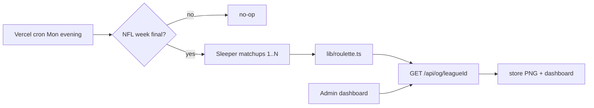

# Roulette standings generator

This workspace ([/Users/totsrocket/Downloads/roulettestandings](/Users/totsrocket/Downloads/roulettestandings)) is an empty git repo. The implementing agent should work **here**, starting by writing project skills, then bootstrapping the app. Public product surfaces are **scaffolded only** in phase 1; phase 2 is specified below so the later agent has a contract.

## Product rules

Scoring is **not** Sleeper’s default standings. Recompute every regular-season week from matchups:

- **WIN**: head-to-head win (strictly higher weekly score in the paired `matchup_id`). A tie is not a win.
- **ROU**: +1 if that week’s score is in the top half of the league (`floor(n/2)` → 6 of 12, 5 of 10). Eligible even on a loss or a tie. If two (or more) teams are tied for the last roulette spot, **all of them get ROU** — do not break the cutoff with PF, username, or matchup result.
- **Matchup PTS**: winner **2**, loser **0**, **H2H tie: both teams 1**. Every matchup awards 2 standings points in total.
- **PTS**: `2 * WIN + TIE + ROU` (with no ties this equals `2 * WIN + ROU`, matching the sheet: 11 wins + 13 ROU = 35).
- **PF**: sum of weekly Sleeper points (share-image last column; green color scale like the sheet’s PPG column).
- Regular season only: weeks `1 .. playoff_week_start - 1` (Shadynasty 2025 is week 15 playoffs).
- Skip the current NFL week until it is final.
- Rank rows by PTS desc, then PF desc.

### Share image (phase 1 must-have)

The dashboard **must** include a **Download** button per league that saves the generated PNG (not only an on-page preview). Filename like `{league-slug}-{season}-w{week}.png`.

Match the attached spreadsheet crop:

- **Square canvas** (`width === height` on `ImageResponse`; size the table to fill it — 12-team and 10-team both stay square, extra vertical padding for 10-team leagues).
- **One row per team**, ranked PTS then PF.
- **Four stat columns only:** **WIN**, **ROU**, **PTS**, **PF**. Left label column is the Sleeper username (as in the attachment). Header may include the season year; do not add extra stat columns (no PPG, no W-L).
- Spreadsheet look: unique stable team row tints, white/uncolored WIN cells, PF color scale.
- **Playoff highlight:** after ranking, mark the teams in playoff position. Count = Sleeper `league.settings.playoff_teams` (persist on `League`; Shadynasty is 6). Highlight those rows distinctly (stronger fill, left bar, or bold username — must be obvious in the PNG). If two teams are tied on PTS and PF for the last playoff seed, highlight **both** (same inclusive-cutoff idea as ROU).

Phase 1 does **not** post to Sleeper chat (official API is read-only). Cron generates PNGs; **Download** and paste into league chat. **Phase 2 includes automated chat upload** (see below).

## Hosted 2026 leagues

**Phase 1:** hardcode as a static registry (`lib/leagues.ts` / env), not username discovery or an admin form:

- LoSRB — `1312059475418435584` (12, redraft)
- MFL — `1312064033167282176` (10, redraft)
- Shadynasty Fantasy Lounge — `1312897670829862912` (12, dynasty)
- Game of Dyno — `1318054540800462848` (12, dynasty)
- League of Unwavering Faith — `1312903288433172480` (12, dynasty)

**Phase 2:** PIN-gated `/admin` (copy [tournamentleagues admin](file:///Users/totsrocket/Documents/Projects/tournamentleagues/app/admin/page.tsx)): paste Sleeper `league_id`s, `getLeague` to name them, upsert into the registry, then `syncAll()`. Hardcoded IDs remain the seed/fallback.

Validate the engine against **2025 Shadynasty** (`1180599038981910528`, via `previous_league_id`) vs the attached screenshot (RDeezus 11/13/35, aruiz1991 11/13/35, etc.). Exact week cutoff of that screenshot may be mid-season; treat it as a ranking/PTS-formula check, not a pixel-perfect weekly lock. Include a fixture where a matchup is tied so both sides get 1 PTS.

## Skills the implementing agent must use

Write these into `.cursor/skills/` **before** app code (create-skill). The next agent should follow them instead of inventing a new Sleeper client.

1. `**sleeper**` — adapt [rotorooster packages/sleeper client](file:///Users/totsrocket/Documents/Projects/rotorooster/packages/sleeper/src/client.ts) + [tournamentleagues lib/sleeper.ts](file:///Users/totsrocket/Documents/Projects/tournamentleagues/lib/sleeper.ts): `sleeperGet` to `https://api.sleeper.app/v1`, `cache: "no-store"`. Required helpers: `getNflState`, `getLeague`, `getLeagueUsers`, `getRosters`, `getMatchups`, `getWinnersBracket`, `getUser`, `getUserLeagues`, `walkPreviousLeagues` (`previous_league_id` + seen-set, from [tendencies.ts](file:///Users/totsrocket/Documents/Projects/rotorooster/apps/draft/lib/tendencies.ts)), `liveMatchupPoints` (from [tournamentleagues lib/scores.ts](file:///Users/totsrocket/Documents/Projects/tournamentleagues/lib/scores.ts)), `pairMatchups` by `matchup_id`.
2. `**roulette-scoring**` — the rules above (including H2H tie = 1 PTS each); pure functions; fixture tests.
3. `**standings-image**` — square `next/og` `ImageResponse`; one team row; columns WIN/ROU/PTS/PF; playoff rows from `settings.playoff_teams`; Download button required.
4. `**weekly-final**` — Monday cron + ESPN NFL scoreboard completeness (Sleeper has no “games final” flag).

Also follow existing Cursor/Vercel skills during scaffold: **nextjs**, **shadcn**, **bootstrap**, **vercel-functions** (crons), **neon-postgres**, **prisma**. Do not duplicate `@rotorooster/sleeper` as a workspace package; copy the thin client into this repo.

## Architecture (phase 1)

**Stack** (same family as tournamentleagues / rotorooster manage): Next.js 16 App Router, React 19, Tailwind 4, shadcn, Prisma 6, Neon, Vercel. Dark admin shell; the **share image stays light/spreadsheet** so it matches what you already post.

**Sync, don’t trust `roster.settings` for PTS.** Sleeper roster wins should match computed WIN, but ROU and tie PTS only come from weekly score ranks. Persist weekly rows so images stay stable after Sleeper’s live points settle.

Suggested Prisma models: `League` (sleeper id, season, `previousSleeperLeagueId`, `playoffWeekStart`, `playoffTeams` from `settings.playoff_teams`, `totalRosters`), `Team`, `WeeklyScore` (points, matchupId, won, tied, roulette), `GeneratedImage` (week, blob/url). PIN cookie admin (`ADMIN_PIN`) like tournamentleagues; not end-user auth yet.

## App surfaces this run

Build:

- `lib/sleeper.ts`, `lib/roulette.ts`, `lib/sync.ts`, `lib/nfl-final.ts`
- PIN-gated `/` dashboard: five leagues, live table (username, WIN, ROU, PTS, PF), **Download** button that fetches the square PNG (`Content-Disposition: attachment`)
- `GET /api/og/[sleeperLeagueId]` — square `ImageResponse` PNG (playoff rows highlighted)
- `GET /api/cron/weekly-images` — Bearer `CRON_SECRET`; if ESPN says the NFL week is complete and images for that week are missing, sync + generate all five
- Cron schedule: hourly `0 2-7 * * 2` UTC (Monday evening through early Tuesday ET), plus a no-op when the week is not final or already generated
- Unit tests for `computeRouletteWeek` / `computeRouletteSeason` with a 10- and 12-team fixture, plus one tied matchup (both sides 1 PTS, WIN unchanged, ROU still available) and one week where two teams tie for the last ROU spot (both get ROU)

Scaffold only (empty routes + comments pointing at tournamentleagues files to copy in phase 2):

- `/u/[username]` landing (`getUser` + intersect hosted leagues)
- Standings page league toggle, history year dropdown (`previous_league_id`)
- Matchups block ([matchup-table.tsx](file:///Users/totsrocket/Documents/Projects/tournamentleagues/components/matchup-table.tsx))
- Tabs: weekly schedule ([weekly/page.tsx](file:///Users/totsrocket/Documents/Projects/tournamentleagues/app/weekly/page.tsx)), playoff bracket ([playoff-bracket.tsx](file:///Users/totsrocket/Documents/Projects/tournamentleagues/components/playoff-bracket.tsx))
- `/admin` league-ID form (phase 1: PIN login + hardcoded list only)
- Standings **Sync** control (wire in phase 2)

## Phase 2 (later agent — do not build now)

- **Public app:** username gate, league toggle among that user’s hosted roulette leagues, matchups under standings, schedule tab, Sleeper winners-bracket tab, year history via `previous_league_id`.
- **Admin league registry:** `/admin` form to add/remove Sleeper league IDs; persist in Neon; sync on save. Same pattern as tournamentleagues `POST /api/admin/config`.
- **Sync button:** copy [LiveSyncButton](file:///Users/totsrocket/Documents/Projects/tournamentleagues/components/live-sync-button.tsx) + [POST /api/live](file:///Users/totsrocket/Documents/Projects/tournamentleagues/app/api/live/route.ts) (15s cooldown, `syncLiveScores`) and stale [maybeRefresh](file:///Users/totsrocket/Documents/Projects/tournamentleagues/lib/maybe-refresh.ts) (live ~45s, full ~5min). Show it on the public standings page (and keep it on the commissioner dashboard).
- **Sleeper chat upload:** after the Monday cron generates PNGs, post each league’s image into that league’s Sleeper chat. Official API cannot write; this needs the unofficial GraphQL path (`https://sleeper.com/graphql`) with a commissioner session JWT (`SLEEPER_TOKEN` in Vercel env, never committed). Plan for token expiry (manual re-capture, fail closed to “image ready on dashboard” if the token is dead). If the mutation cannot be confirmed, ship dashboard download plus a documented capture runbook rather than a half-working bot.

## Bootstrap order

1. Write `.cursor/skills/*` and a short `AGENTS.md` (product rules including tie PTS, league IDs, and a Phase 2 section).
2. `create-next-app` (App Router, TS, Tailwind, no src dir unless existing TOTS apps prefer it — tournamentleagues uses app at root).
3. shadcn baseline primitives (button, card, input, table, dialog).
4. Link Vercel + Neon via bootstrap/neon skills; `vercel env pull`; Prisma migrate.
5. Implement Sleeper client → roulette → OG → dashboard → cron.
6. Verify: compute 2025 Shadynasty, compare PTS/WIN/ROU shape to the screenshot; open dashboard in the browser; click **Download** and confirm a square PNG with four columns and the top `playoff_teams` rows highlighted; hit cron locally with a fake-final fixture.

Do not create a second git remote if one already exists. Do not invent a TOTS Jira label for this product unless asked.